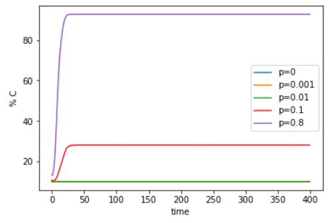
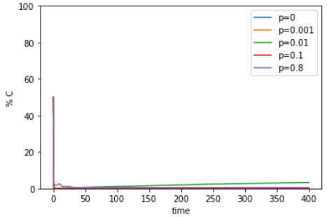
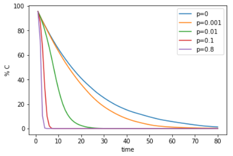
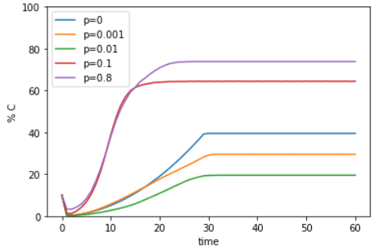
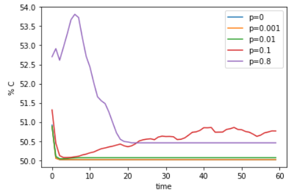
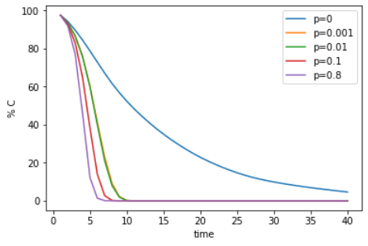

### The Effect of Clustering on the Emergence of Cooperation in the Spatial Prisoner's Dilemma

Noah Rivkin, Changjun Lim

#### Abstract:

We attempted to reprodece and expand upon the findings of Masuda and Aihara[1]. Masuda and Aihara's work examines the spatial prisoners dilemma on small world graphs. They found that cooperative behavior emerged in a wide range of conditions. When we replicated their experiment we found qualitatively similar results, but under a smaller range of conditions. We also expanded on their original work by incorporating additional types of small world graphs. They had used only Watts-Strogatz[2] type graphs, while we tested Holmes-Kim graphs[3]. Masuda and Aihara suggest that their work may suggest why small-world networks are so prevalent in society. They also suggest that one reason why cooperation does not always dominate could be that the rewards for defection are too high. Our analysis suggests that their results do not hold under preferentialy attachment, which provides an additional explanation for real world examples where cooperation is not dominant.

Introduction:

We can find cooperation within groups in every ecological and social system. But In the game theory, the prisoner's dilemma describes the situation that each individual is tempted to defect. So there was many attempt to resolve dilemma, like iterated games and spatical games.

-methodology

-- what is the prisoners dilemma

The types of graphs which Masuda and Aihara use are regular graph and square lattice graphs with rewiring. They set the number of node, n is 3600 and each node has the 8 neighbors in all graph by keeping the degree of each node constant when they rewire graphs. 

-- implementation

Models and Results:

In order to validate our model we needed to show that it shared behavior with Masuda and Aihara's[1] model. To do this, we tested what values of T lead to cooperation. In their work they used a rewired regular graph with n=3600 and k=8, and determined the percentage of the population that was cooperative for different values of T. A critical point was found at T=2.25 for p=0 and p=0.01. When we attempted to reproduce their results we found qualitative similarities, but a critical point of T=2 for p=0 and p=0.01. The transition region was 1.999<T<2, which is smaller than we expected. We also conducted the experiment using a 60 by 60 lattice. Masuda and Aihara found 4 distinct regimes, the last of which showed defection to be completely dominant after T=2.25. As before, our findings where qualitatively similar, but with only 3 regimes and lower values of T. 

(figure 1)

We have been unable to determine the reason our results differ from the original experiments. Rewiring is not present when p=0, but our finding still vary. One possibility is that the initial distribution of cooperators is responsible. However, averaging the results over 10 trials makes this unlikely.

 
In the first experiment, we observed that there are 3 regimes after stabilization. In the second regime, the proportion of cooperators decreases as rewiring parameter p increases, that is, clustering coefficient decreases. We draw the proportion of cooperator over time graph to check the tendency of the network over time. We simulate it by giving 3 values of b and c0(the initial cooperator ratio) pair for each regime and changing p value with 0, 0.001, 0.01, 0.1, and 0.8. We set the first condition for Fig 2.(a) and (d) as b = 1.1 and c0 = 0.1 because cooperators are dominant in the first regime. The second condition for Fig 2.(b) and (e) is b = 1.7 and c0 = 0.5. The third condition for Fig 2.(c) and (f) is b = 3 and c0 = 0.995 since defectors are dominant.
 
Unlike Masuda and Aihara observed that cooperators dominate defector in the first condition, the proportions of cooperators converge to small values in many graphs. The proportion of cooperators after transient increases when p is large in Fig. 2(a), and small p in Fig. 2(d). If a cooperator is among defects, it will always get less gain than defectors. So cooperators should be clusterred at the beginning in order to dominate. However, cooperators are surrounded by defectors under the low initial condition so defectors dominate.

The graphs have about half value after transient for Fig2. (b) and (e). 
In the third condition for Fig. 2(c) and (f), the cooperators ratio converge to 0 and the graph converges faster with bigger p as we expected. Since the path length decreases as p increases, the defector spreads faster with bigger p.

Fig. 2.(a)

Fig. 2.(b)

Fig. 2.(c)

Fig. 2.(d)

Fig. 2.(e)

Fig. 2.(f)

(Expansion - not yet)

-- description

-- figure with caption

-- reasoning/interpretation

Conclusions:

### Annotated Bibliography:

[1] [**Spatial prisoner’s dilemma optimally played in small-world networks**](http://www.sciencedirect.com/science/article/pii/S0375960103006935#bBIB002)

Masuda, N., & Aihara, K. (2003). Spatial prisoner's dilemma optimally played in small-world networks. Physics Letters A, 313(1), 55-61.

Masuda and Aihara simulate an iterated prisoners dilemma with automata that interact only if they are connected on a graph. They simulate this on different types of networks, including regular graphs, lattices, and small-world networks. They find that small world networks produce cooperation to the greatest extent. They also investigate the effects of noise on the system, and consider the robustness of cooperation on the different networks.